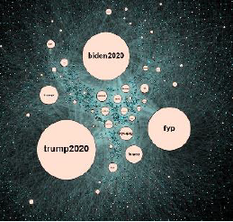

# TikTok Analysis

The goal of this project is to gather insights from the social media platform TikTok and its political impact. In this case two prominent hashtags are compared: #trump2020 and #biden2020. 

## data/

Data is gathered with the usage of [TikTokApi](https://github.com/davidteather/TikTok-Api).

In the data folder are three types of data
- Graph Data
- Raw Data
- Processed Data

## src/

### src/preprocessing.ipynb

The raw data from _data/raw/..._ is transformed to a usable format and saved into _data/processed/..._

### src/create_graph.ipynb

irst, an networkx MultiGraph is created with two node types: users and hashtags. Second, multiple edges are accumulated and merged to create edges with weight > 1.0.
The resulting graph is undirected and saved as _.gexf_ (gephi file) into _data/graphs/..._

### src/data_visualizations.ipynb

This notebook is used to create plots to show the affiliation for each hashtag.

## gephi/

Contains graph projects created in gephi.

## Social Network Graph

A picture from the visualization of the TikTok network with users and hashtags.

